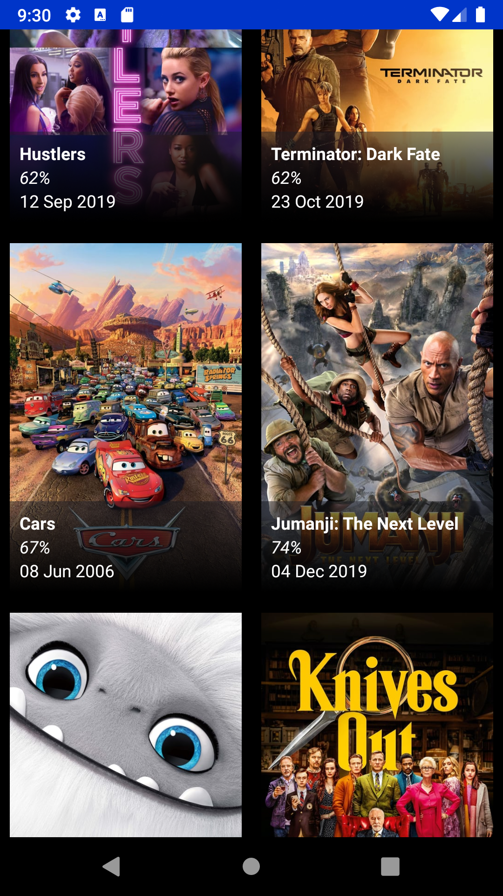

# Popular movies list

Basic Android native application displaying a list of films from themoviedb API

- It uses <https://developers.themoviedb.org/3/movies/get-popular-movies> URL 
to get the movies list

- Movie item contains the poster image of each movie in the list, along with the title, voting average (displayed as a percentage) and release
date.
- The list is scrollable (there are about ~20k movies).

Please define Movied DB API v3 key as system variable e.g.
*export MOVIE_DB_API_V3_KEY='your API key'*

To make it running just import it to Android Studio v3.5.3 or 
use ./gradlew assemble command to assemble the apk and install it on a device

TODO:
- add progress when loading more pages and improve next page loading experience
- improve error handling, i.e. retry logic and displaying e.g. a snackbar when
error occurs and some data is already loaded
- Use MockWebServer or similar to mock network connection in the 
UI/instrumentation tests and write more tests
- add static code analysis tool (deteKt)
- add favourite film selection
- more testing...